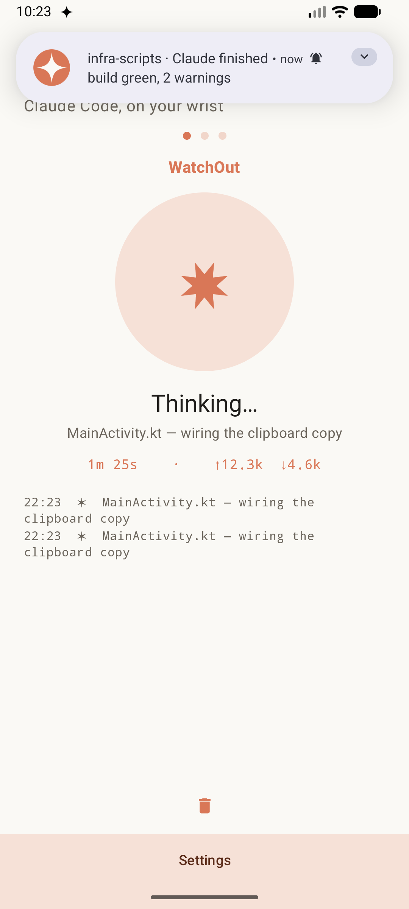
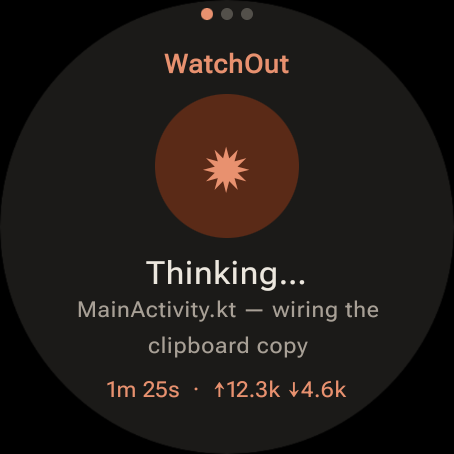
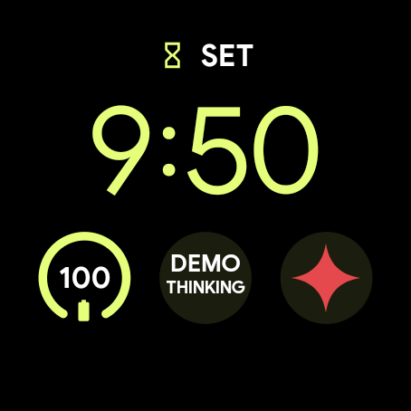
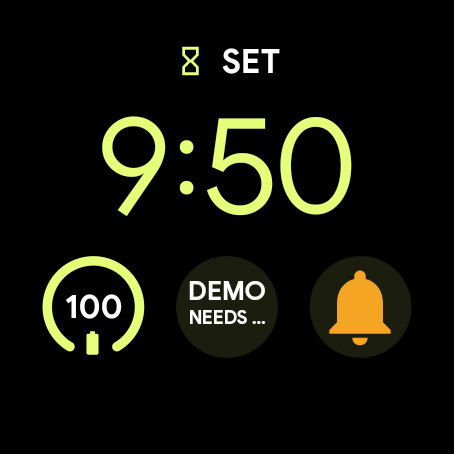
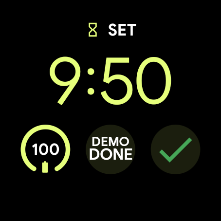

# WatchOut

See what Claude Code is doing — on your phone and your wrist.

WatchOut is an Android + Wear OS app fed by [Claude Code](https://docs.claude.com/en/docs/claude-code)
hooks. A small Python hook turns each Claude Code event into a status update and ships it to
the phone app, which renders it (animated status blob, current file, elapsed time, token
usage, recent events) and relays it to the watch — with a buzz when Claude finishes or needs
your input.

```
Claude Code hooks ──▶ plugin/scripts/notify.py ──▶ (FCM | direct | ntfy) ──▶ phone app ──▶ watch
```

## Screenshots

| Phone — session view | Watch — mirror |
|:---:|:---:|
|  |  |

Watch-face complications — the signal glyph carries the status (spark · bell · check):

| Thinking | Needs input | Done |
|:---:|:---:|:---:|
|  |  |  |

## Features

- **Live status** — thinking / needs-input / done, current file, elapsed time, token usage.
- **Multiple sessions** — one tab per project (by `cwd`), swipe between them on phone and watch.
- **Watch app** — mirrors the phone over the Wear Data Layer; buzzes on done / needs-input.
- **Watch complications** — *Claude status* (text) and *Claude signal*: a status glyph (spark /
  bell / check / ring) that tints to your watch-face theme on a monochrome slot, or shows the
  status color (red/amber/green) on a small-image slot.
- **Three transports**, pick one in Settings — no Firebase required for the first two:
  - **direct** (default) — phone runs a small HTTP listener on your LAN / Tailscale (mDNS auto-discovery).
  - **ntfy** — self-host with Docker or use ntfy.sh.
  - **FCM** — push via Firebase; paste `google-services.json` in Settings, no rebuild needed.
- **Persistent notification** (optional) mirroring the home screen.

## Repo layout

| Path | What |
|------|------|
| `mobile/` | Phone app (Kotlin) — UI, transports, watch sync, notifications |
| `wear/`   | Wear OS app (Compose) — status screen + complications |
| `plugin/` | Claude Code plugin: the `notify.py` hook + manifests — see [plugin/README.md](plugin/README.md) |

## Quick start

1. **Build & install** the apps from Android Studio (`:mobile` to your phone, `:wear` to the watch).
2. **Pick a transport** in the phone app's Settings (defaults to *direct* — no Firebase).
3. **Install the plugin** so Claude Code's hooks are wired automatically:

   ```sh
   claude plugin marketplace add greasycat/WatchOut
   claude plugin install watchout@watchout
   ```

   Then create `~/.config/watchout/config.json` (`{ "transport": "direct" }` to start).
   Full config + transports in **[plugin/README.md](plugin/README.md)**.

The default `direct`/`ntfy` transports are pure stdlib — the hook runs on system `python3`
with nothing to install.

## License

[MIT](LICENSE)
